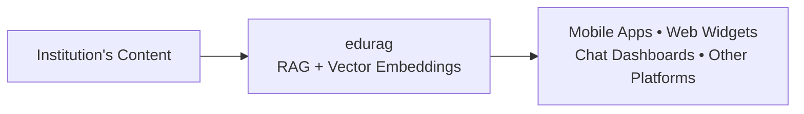

# edurag

Reusable RAG API backend for accurate AI assistants in education. Any institution can integrate via mobile, web, dashboards or other platforms.

This project provides a backend API using retrieval-augmented generation (RAG) with vector embeddings. It helps deliver accurate responses from an institution's own content, addressing cases where generic AI produces inaccurate or low-productivity output.

## High-Level Flow



## Stack

- Python 3 + Flask
- LangChain (langchain-classic, langchain-chroma, langchain-huggingface, langchain-groq, langchain-text-splitters)
- Groq (llama-3.3-70b-versatile)
- Hugging Face sentence-transformers (all-MiniLM-L6-v2) for embeddings
- Chroma vector store (persistent)
- SQLite for conversation history
- BeautifulSoup4 + requests for ingestion

See [docs/ARCHITECTURE.md](docs/ARCHITECTURE.md) for component diagrams, request flows, and module responsibilities.

## Project Layout

```
edurag/
├── app/
│   ├── __init__.py      # Flask app factory
│   ├── routes.py        # HTTP endpoints
│   ├── chatbot.py       # RAG chat logic + prompt + LLM/retriever
│   ├── db.py            # SQLite session message store
│   ├── ingest.py        # One-shot scraper + vector store builder
│   ├── templates/
│   │   └── index.html   # Empty placeholder
│   └── static/
│       ├── css/style.css
│       └── js/chat.js
├── run.py               # Dev entrypoint
├── docker-compose.yml
├── Procfile
├── requirements.txt
└── README.md
```

## Environment Variables

- `GROQ_API_KEY` (required): Groq API key for LLM calls.
- `SECRET_KEY` (optional): Flask secret key. Defaults to `change-in-prod`.
- `DB_PATH` (optional): Path to SQLite database. Defaults to `conversations.db`.

Place variables in `.env` (loaded by dotenv in chatbot.py). Copy `.env.example` as a starting point.

## Local Development

```bash
python -m venv venv
source venv/bin/activate
pip install -r requirements.txt

`requirements.txt` declares CPU-only PyTorch (via PyTorch CPU index) because only the embedding model uses it. The LLM is served by the Groq API.

Create `.env` with `GROQ_API_KEY`.

Build the knowledge base (required before first use):

```bash
python -m app.ingest
```

Start the server:

```bash
python run.py
```

API available at http://localhost:5000

## Docker

```bash
docker compose up --build
```

Volume mounts:
- Source for live reload
- `chroma_db/` for persisted vectors

## Running the Ingest

The ingest script scrapes pages and builds the vector store in `chroma_db/`. The current list of URLs is an example for one institution. Replace it with pages from the target educational institution (or supply your own documents) before running.

```bash
python -m app.ingest
```

Existing `chroma_db/` is overwritten on run.

## Using with your institution

edurag is designed to be adapted. To use for a different educational institution:

- Update the URL list in `app/ingest.py` (or replace the scraping logic with your own content loader).
- Edit the system prompt in `app/chatbot.py` to set the correct name, tone, and contact details for the institution.
- Re-run the ingest script to build a fresh vector store.

The resulting `/chat` endpoint can then be called from any client: mobile applications, web widgets, chat dashboards, or other platforms that need reliable AI assistance.

## API

### POST /chat

Request:

```json
{
  "message": "What programs are offered?",
  "session_id": "optional-uuid"
}
```

Response:

```json
{
  "ok": true,
  "session_id": "uuid",
  "message": {
    "role": "assistant",
    "content": "..."
  }
}
```

- If no `session_id`, a new UUID is generated.
- History (last 10 messages) is loaded from SQLite for the session and passed to the LLM.
- Both user message and assistant reply are persisted after generation.

### GET /health

```json
{"ok": true, "status": "running"}
```

## Behavior

- Retrieval: Top 6 chunks from Chroma using the question embedding.
- Context is injected into a system prompt.
- The system prompt instructs the model to respond naturally without referencing retrieval or documents.
- LLM temperature fixed at 0.3.
- Per-thread LLM instances to avoid thread-safety issues with ChatGroq under Flask threaded mode.
- Chat history is trimmed to most recent 10 messages per session (chronological order restored before LLM call).
- No streaming. Single-turn response per request.

## Frontend

`app/templates/index.html`, `app/static/css/style.css`, and `app/static/js/chat.js` are empty placeholder files. The delivered API surface is the backend only.

## Deployment Notes

- Procfile targets gunicorn with 2 workers / 4 threads.
- In production set `SECRET_KEY` and ensure `GROQ_API_KEY` is available.
- `chroma_db/` must be persisted across restarts (volume or mounted path).
- `conversations.db` is created on first request if missing.

## License

No license file present in repository.
