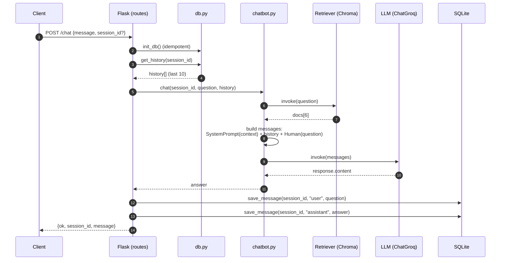
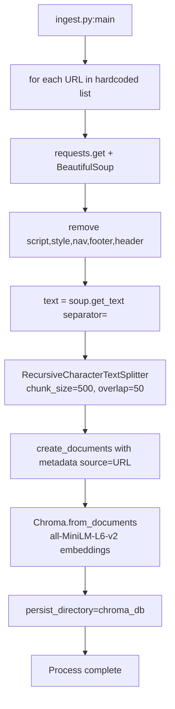
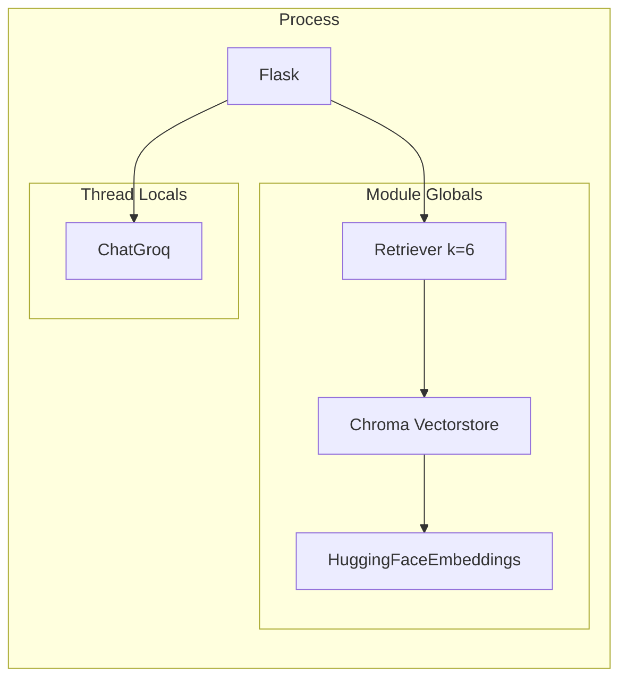

# Architecture

This document describes the current implementation of edurag (Reusable RAG API backend for accurate AI assistants in education).

## System Purpose

Provide a retrieval-augmented generation (RAG) HTTP API that any educational institution can use to answer questions based on its own content. The backend uses vector embeddings to ground responses. A specific assistant persona and data source (e.g. scraped pages from one institution) are used as an example.

## High-Level Components

```
┌─────────────────┐       ┌──────────────────────┐
│   HTTP Client   │──────▶│  Flask Application   │
│  (any / web UI) │       │   (app/)             │
└─────────────────┘       └──────────┬───────────┘
                                     │
                                     ▼
┌─────────────────────────────────────────────────────────────┐
│                       Request Handling                       │
│  routes.py: /chat, /health                                   │
│    - extract message + optional session_id                   │
│    - load history from SQLite                                │
│    - call chatbot.chat(...)                                  │
│    - persist user + assistant messages                       │
└─────────────────────────────────────────────────────────────┘
                                     │
                                     ▼
┌─────────────────────────────────────────────────────────────┐
│                     Chatbot (chatbot.py)                     │
│  - Global: HuggingFaceEmbeddings + Chroma retriever (k=6)   │
│  - Per-thread: ChatGroq (llama-3.3-70b-versatile, t=0.3)    │
│  - Fixed SYSTEM_PROMPT with university persona rules         │
│  - Retrieval → context injection → history + question → LLM  │
└─────────────────────────────────────────────────────────────┘
                                     │
                    ┌────────────────┼────────────────┐
                    ▼                ▼                ▼
            ┌──────────────┐  ┌──────────┐   ┌─────────────┐
            │   Chroma     │  │  Groq    │   │   SQLite    │
            │ (vector DB)  │  │  (LLM)   │   │ (chat hist) │
            └──────────────┘  └──────────┘   └─────────────┘
```

## Core Modules

| Module         | Responsibility |
|----------------|----------------|
| `app/__init__.py` | Flask application factory. Registers blueprint. Sets CORS and secret key. |
| `app/routes.py`   | Blueprint with `POST /chat` and `GET /health`. Calls init_db on every request. Generates session_id if absent. |
| `app/chatbot.py`  | RAG implementation. Module-level retriever and embeddings. Thread-local LLM. System prompt construction and LLM invocation. |
| `app/db.py`       | SQLite wrapper. `messages` table (id, session_id, role, content, created_at). History limited to last 10 messages (reverse chronological on read, restored before LLM). |
| `app/ingest.py`   | Offline data pipeline. Hardcoded list of 18 URLs. Scrapes, strips structural tags, splits (500/50 overlap), embeds, writes to Chroma. |
| `run.py`          | Development server launcher. |
| `docker-compose.yml` | Single web service. Mounts source + chroma_db volume. Uses .env file. |
| `Procfile`        | gunicorn invocation for platform deployments. |

## Data Stores

- **Vector store**: `chroma_db/` directory (Chroma persistent). Contains embeddings + documents + metadata (source URL). Created exclusively by ingest.py.
- **Conversation store**: `conversations.db` (SQLite). Per-session message log. No foreign keys or additional indexes beyond the implicit ones. `get_history` returns most recent N rows reversed to chronological order.

## Chat Request Flow (Sequence)



## Ingestion Pipeline



## Retrieval and Prompting

- Embeddings model: `all-MiniLM-L6-v2` (HuggingFaceEmbeddings). Loaded once at import time.
- Retriever: `vectorstore.as_retriever(search_kwargs={"k": 6})`. Global singleton.
- Context construction: `"\n\n".join(d.page_content for d in docs)`
- The system prompt is defined in `app/chatbot.py`. It is an example for an educational institution and should be replaced with institution-specific instructions when adapting the system.

- History messages are converted to HumanMessage / AIMessage.
- New question appended as final HumanMessage.
- No tool calling, agents, or LangGraph nodes are executed at runtime (langgraph is listed in requirements but unused by source).

## Concurrency Model

- Flask run with `threaded=True` (development) and gunicorn (workers + threads) in production.
- Embeddings and Chroma retriever are treated as read-only after module load.
- LLM instances are stored in `threading.local()` because `ChatGroq` is documented as non-thread-safe.
- SQLite connections are created per operation (no connection pooling).

## Initialization Order (at import / first request)

1. `run.py` imports `create_app`.
2. `app/__init__.py` creates Flask instance and registers blueprint.
3. First request triggers `bp.before_app_request` → `init_db()`.
4. `chatbot.py` top level executes on first import:
   - `load_dotenv()`
   - Instantiates global `embeddings` and `vectorstore` + `retriever`.

## Configuration Surface

All configuration is environment-driven. No config files or command-line flags beyond what Flask/gunicorn accept.

| Name            | Used by          | Default             | Notes |
|-----------------|------------------|---------------------|-------|
| GROQ_API_KEY    | chatbot.py       | (none)              | Required for ChatGroq |
| SECRET_KEY      | app/__init__.py  | change-in-prod      | Flask signing |
| DB_PATH         | db.py            | conversations.db    | SQLite file location |

## Non-Functional Characteristics (Observed)

- No authentication or rate limiting implemented.
- No input sanitization beyond `.strip()` on message.
- Error responses return raw exception strings on 500.
- Ingest is not exposed via HTTP; it is a standalone CLI script.
- Vector store and database are file-based and must be volume-mounted for persistence.
- All scraping targets are static in source (no dynamic discovery or sitemap).

## Diagrams Summary

- Component overview (top)
- Sequence for `/chat` (above)
- Ingestion pipeline (above)

Additional runtime view:



## Files of Record

All behavior is defined in the Python modules listed under "Core Modules". No external configuration or generated code drives the RAG or persistence logic.
